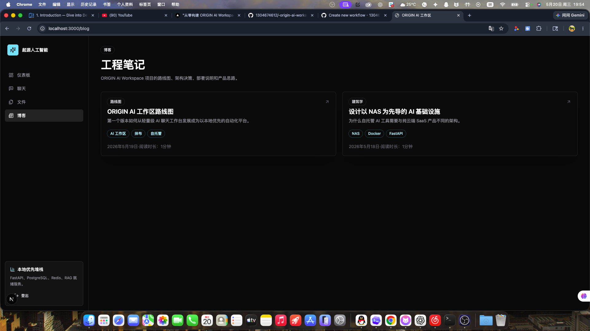

<p align="center">
  
</p>

<p align="center">
  
  
  
  
  
</p>

## What Is ORIGIN?

ORIGIN AI Workspace is a lightweight self-hosted AI workspace for developers, students, NAS users, and personal workflows. It provides authenticated AI chat, conversation management, uploads, a RAG-ready document schema, a Markdown blog engine, and Docker/Nginx deployment.

## Screenshots

<p align="center">
  
  
  <br>
  
  
</p>

## Features

| Category | Current capability |
|----------|--------------------|
| AI Chat | Streaming responses, Markdown rendering, model switching, temperature and token controls, conversation history. Streaming-safe rendering: code highlighting deferred until completion, translator-resistant DOM. |
| Auth | JWT registration/login, bcrypt password hashing, profile and password management |
| Dashboard | Workspace summary endpoint with conversation/file/knowledge counts, recent items, service health cards (FastAPI / PostgreSQL / Redis / RAG), skeleton loading, error fallback |
| Files | Upload PDF, TXT, Markdown, DOCX, and images. TXT/Markdown/DOCX text extraction is implemented; PDF extraction and image OCR are planned adapters. |
| Knowledge | AI-generated Markdown notes and a RAG-ready document/chunk schema |
| RAG Pipeline | Document chunking, pgvector vector store, OpenAI embeddings (production). A local hash-based embedding provider is included for **development only** — it is NOT semantic and should be replaced with OpenAI, BGE, Jina, or Ollama embeddings for real retrieval. |
| Blog | Markdown blog engine with dark-mode reading pages |
| Deploy | Docker Compose with PostgreSQL, Redis, Nginx (SSE-friendly), uploads volume, and health checks |

## Docker Deployment

```bash
cp .env.docker.example .env
openssl rand -hex 32
# Paste the generated value into JWT_SECRET_KEY.
# Change POSTGRES_PASSWORD before exposing the service.
docker compose up -d --build
```

Open `http://localhost:8080`.

The web app uses same-origin API requests by default (`/api`). Nginx proxies `/api/*` to FastAPI, so browsers use the current host instead of a baked-in `localhost` address.

## Local Development

Run PostgreSQL and Redis locally, then:

```bash
cp .env.local.example .env
openssl rand -hex 32
# Paste the generated value into JWT_SECRET_KEY.
npm install
```

Backend:

```bash
python3.11 -m venv apps/api/.venv
apps/api/.venv/bin/pip install -e "apps/api[dev]"
npm run api:migrate
npm run dev:api
```

Frontend:

```bash
npm run dev:web
```

Open `http://localhost:3000`. During local development, Next.js rewrites `/api/*` to `ORIGIN_API_URL` from `.env.local.example`.

## Environment

| File | Purpose |
|------|---------|
| `.env.example` | Minimal template; unsafe until secrets are filled |
| `.env.local.example` | Local development with `localhost` services and `./uploads` |
| `.env.docker.example` | Docker/NAS deployment with container hostnames and `/app/uploads` |

`JWT_SECRET_KEY` is required and must be secure. Generate it with:

```bash
openssl rand -hex 32
```

Common placeholders such as `change-me`, `default-secret`, and `replace-this` are rejected at startup.

## Architecture

```
apps/
  web/          Next.js application
  api/          FastAPI backend
packages/
  ui/           Shared UI components
  shared/       Shared TypeScript types
  config/       Shared config package
docker/
  nginx/        Reverse proxy config
docs/           Architecture and deployment docs
```

| Layer | Stack |
|-------|-------|
| Frontend | Next.js 15, React 19, TypeScript, TailwindCSS |
| Backend | FastAPI, Python 3.11+, SQLAlchemy 2 async, Alembic |
| Data | PostgreSQL 16, Redis 7 |
| AI | OpenAI SDK-compatible streaming provider abstraction |
| Deploy | Docker, Docker Compose, Nginx |

## Scripts

```bash
npm run typecheck
npm run lint
npm run build
npm run api:migrate
```

## Roadmap

| Version | Focus |
|---------|-------|
| v0.1 | AI Chat, JWT auth, Dashboard, Docker deploy |
| v0.2 | Conversation management, settings, Markdown, PWA, multi-model polish |
| v0.3 | Dashboard summary API, chat streaming stability, code quality cleanup, translator-safe DOM |
| v0.4.0 | Local knowledge base, PDF extraction, OCR adapter, vector retrieval polish |
| v0.4.1 | CI/CD quality: mypy type check, pytest, Vitest, Turborepo, VS Code debugging |
| v0.5 | AI Agent, workflow builder, automation |
| v1.0 | Plugin ecosystem, MCP support, multi-user workspaces, mobile polish |

## Contributing

1. Open an issue for larger changes before coding.
2. Keep changes focused.
3. Run `npm run typecheck && npm run lint && npm test` and backend checks (`npm run test:api`, `cd apps/api && mypy app/`) before pushing.
4. Include screenshots for UI changes.

## License

MIT © 2026 Mickl
