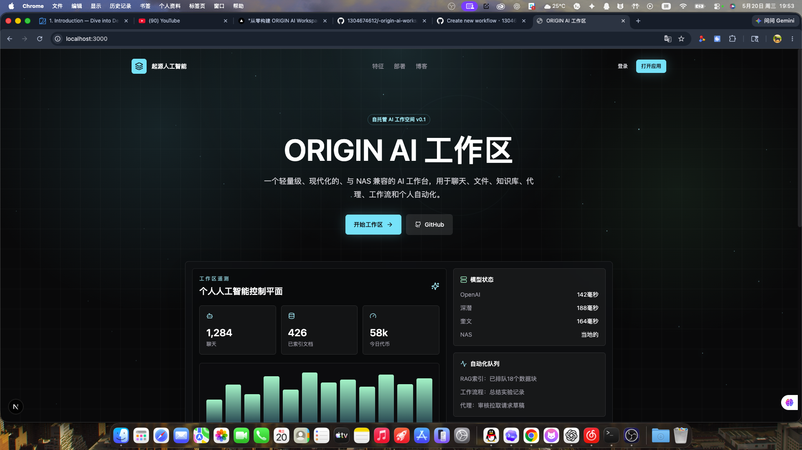
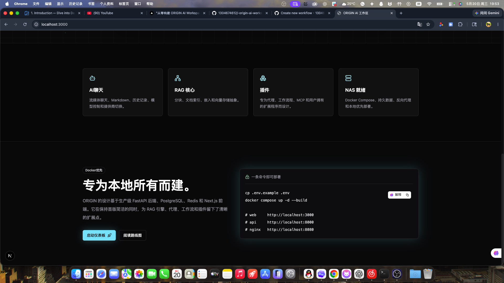
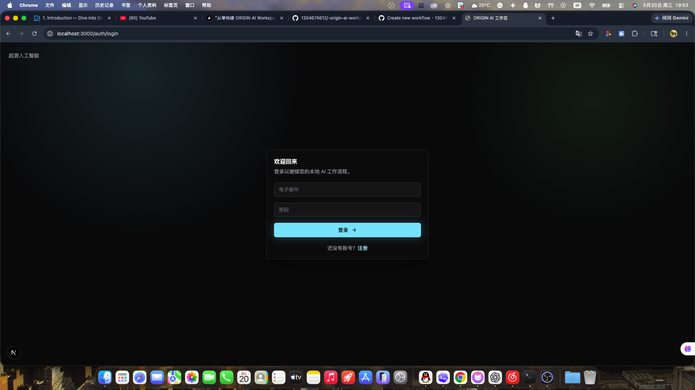

<p align="center">
  
</p>

<p align="center">
  
  
  
  
  
  
</p>

---

## What is ORIGIN?

A lightweight, open-source AI workspace you run on your own machine. Chat with multiple AI models, manage files, monitor usage — all through a clean dark UI. Deploy with a single `docker compose up`.

> Not a cloud service. Not a SaaS demo. Your keys, your data, your machine.

---

## Screenshots

<p align="center">
  
  
  
</p>

---

## Features

| Category | What you get |
|----------|-------------|
| **AI Chat** | Streaming responses, Markdown + code highlighting, multi-model switching (OpenAI / DeepSeek / Qwen / custom), temperature & token controls, conversation history |
| **Auth** | JWT registration & login, bcrypt password hashing, session persistence |
| **Dashboard** | Token usage, model health cards, latency charts, system status |
| **Files** | Upload PDF, TXT, MD, DOCX, images — parser pipeline ready for RAG |
| **Blog** | Built-in Markdown blog engine with tags, syntax highlighting, dark mode |
| **Deploy** | Docker Compose with PostgreSQL, Redis, Nginx — one command to start |

---

## Quick Start

```bash
git clone https://github.com/1304674612/-origin-ai-workspace.git
cd -origin-ai-workspace
cp .env.example .env
# Edit .env with your API keys
docker compose up -d --build
```

Open **http://localhost:8080** and you're in.

<details>
<summary>Local development setup</summary>

```bash
# Frontend
npm install
npm run dev:web        # http://localhost:3000

# Backend
cd apps/api
python3.11 -m venv .venv
source .venv/bin/activate
pip install -e ".[dev]"
alembic upgrade head
uvicorn app.main:app --reload --host 0.0.0.0 --port 8000
```
</details>

---

## Architecture

```
┌─────────────┐     ┌─────────────┐     ┌──────────────┐
│  Next.js 15 │────▶│   Nginx     │────▶│   FastAPI     │
│  (Port 3000)│     │  (Port 8080)│     │   (Port 8000) │
└─────────────┘     └─────────────┘     └──────┬───────┘
                                               │
                          ┌────────────────────┼────────────────────┐
                          │                    │                    │
                     ┌────▼────┐         ┌────▼────┐         ┌─────▼───┐
                     │PostgreSQL│        │  Redis   │         │ Uploads │
                     │   :5432  │        │  :6379   │         │ (Volume)│
                     └─────────┘         └─────────┘         └─────────┘
```

| Layer | Stack |
|-------|-------|
| Frontend | Next.js 15, React 19, TypeScript, TailwindCSS, Framer Motion |
| Backend | FastAPI, Python 3.11+, SQLAlchemy 2 (async), Alembic |
| Data | PostgreSQL 16, Redis 7 |
| AI | OpenAI SDK-compatible streaming, pluggable provider abstraction |
| Deploy | Docker, Docker Compose, Nginx |

---

## Repository

```
apps/
  web/          Next.js application
  api/          FastAPI backend
packages/
  ui/           Shared UI components (shadcn-style)
  shared/       Shared TypeScript types
  config/       Shared config presets
docker/
  nginx/        Reverse proxy config
docs/           Architecture & deployment docs
```

---

## Roadmap

| Version | Focus |
|---------|-------|
| **v0.1** | AI Chat, JWT auth, Dashboard, Docker deploy |
| **v0.2** | Local knowledge base, vector retrieval, document parsing |
| **v0.3** | AI Agent, Workflow builder, automation |
| **v1.0** | Plugin ecosystem, MCP support, multi-user, mobile UI |

---

## Environment Variables

| Variable | Required | Notes |
|----------|----------|-------|
| `JWT_SECRET_KEY` | **Yes** | Min 32 chars. Generate: `openssl rand -hex 32` |
| `OPENAI_API_KEY` | For OpenAI | Or set `DEEPSEEK_API_KEY` / `QWEN_API_KEY` |
| `DATABASE_URL` | No | Defaults to local PostgreSQL |
| `REDIS_URL` | No | Defaults to local Redis |
| `NEXT_PUBLIC_API_URL` | No | Browser-facing API URL |

See `.env.example` for the full list.

---

## Contributing

Issues and PRs are welcome.

1. Open an issue for larger changes before coding
2. Keep changes focused — one PR, one purpose
3. Run `npm run typecheck` before pushing frontend changes
4. Include screenshots for UI changes

---

## License

MIT © 2026 Mickl

---

<div align="center">
  <sub>Built with ❤️ for the self-hosting community</sub>
</div>
